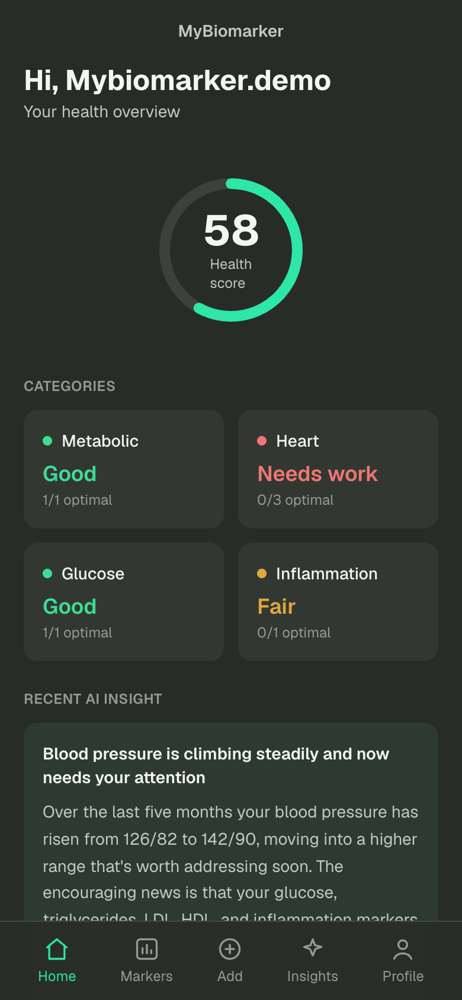
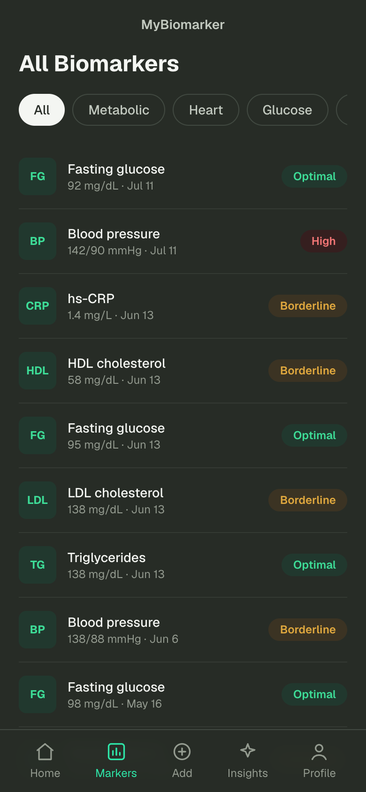
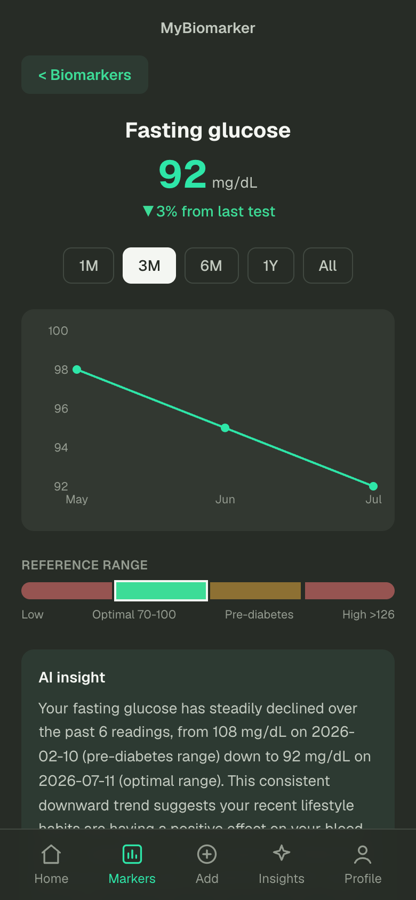
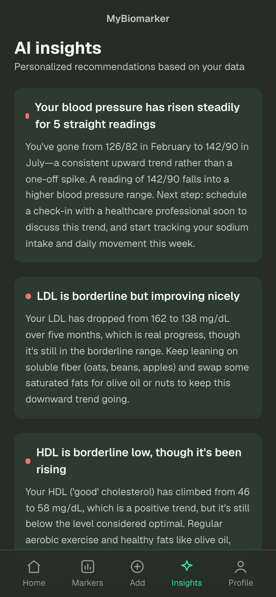
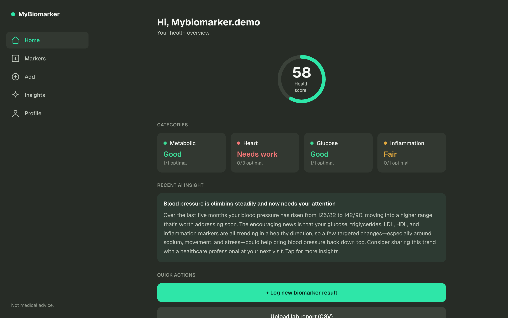

# MyBiomarker

[](https://github.com/kevincodedojo/MyBiomarker/actions/workflows/ci.yml)

Track your key biomarkers over time — fasting glucose, cholesterol, blood pressure, HbA1c — and get AI-powered insights into what the numbers mean, with personalized diet and exercise suggestions.

> ⚠️ For informational purposes only — not medical advice.

**Live demo:** [my-biomarker-one.vercel.app](https://my-biomarker-one.vercel.app) — tap **"Explore the demo"** on the login page, no sign-up needed.
**Full spec:** [spec.md](spec.md) · **Design:** [Figma](https://www.figma.com/design/vlJCAGOeesee9sMzZd3XGc/ashen_MyBiomarker)

## Screenshots

| Home | Markers | Detail | AI Insights |
|---|---|---|---|
|  |  |  |  |

Desktop gets a sidebar layout:



## Features

- **Log biomarkers** one at a time or via **CSV import** with a validating preview
- **Health score** (0–100) and per-category status computed from your latest readings
- **Trend charts** with the optimal range shaded, reference-range bars, and history
- **AI insights** (Claude Sonnet 5): alert cards, food & exercise suggestions with recipes and progressive plans, per-marker trend analysis, and free-form Q&A — generated server-side, validated against zod schemas, and cached per data snapshot so unchanged data never re-bills
- **Installable PWA** with an offline shell; responsive from phone to desktop
- **Row-Level Security everywhere** — users can only ever read their own health data

## Stack

- **Next.js 16** (App Router) + **TypeScript** + **Tailwind CSS v4**
- **Supabase** — Postgres, auth, Row-Level Security
- **Claude API** — structured-output insight generation, server-side only
- **Recharts**, **react-hook-form + zod**, **PapaParse**
- **Vercel** hosting · **GitHub Actions** CI (lint, typecheck, 24 unit tests, build)

## Architecture

One full-stack Next.js app — React UI and API route handlers in a single deployable, backed by Supabase Postgres and the Claude API. Reference ranges live in the database as data, scoring is pure unit-tested functions, and AI output is cached in Postgres keyed by a hash of the readings that produced it. See [spec.md §6](spec.md) for the diagram and the reasoning behind each choice.

## Development

```bash
npm install
cp .env.example .env.local   # fill in Supabase + Anthropic keys
# create the schema: paste db/schema.sql into the Supabase SQL editor
npm run dev                  # http://localhost:3000
```

`npm run lint` · `npm run typecheck` · `npm test` · `npm run build`

Optional: `node scripts/seed-demo.mjs` seeds the demo account, then apply the generated `db/demo-readonly.sql` to lock it read-only.

## Quality

- Lighthouse (production build): **Performance 95 · Accessibility 100 · Best Practices 96 · SEO 91**
- 24 unit tests on the pure logic (status classification, health score, CSV validation, insight caching) running in CI on every push
- Keyboard-navigable with visible focus states, skip link, and AA color contrast

## Roadmap

- [x] **M0** — scaffold, design tokens, CI, deploy
- [x] **M1** — auth, marker catalog, log readings, markers list, detail view with trend chart
- [x] **M2** — health score + category dashboard
- [x] **M3** — AI insights (Claude), food & exercise suggestions
- [x] **M4** — CSV import, PWA, desktop layout
- [x] **M5** — accessibility pass, demo account, polish

Post-freeze backlog: PDF lab-report parsing, units preference (US/SI), data export, Apple Health sync.
